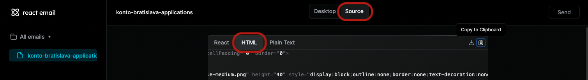
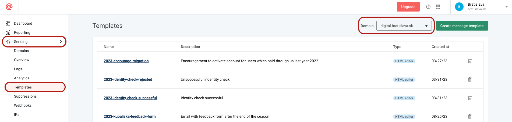

# React Email Starter

Templates for emails used when sending through Mailgun.
Advantages of using this tool:

- Build in dummer version of HTML, not all things that works in html will work in email html, [example](https://blog.edmdesigner.com/html-email-padding-margin-border/)
- Reuse of components

## Getting Started

First, install the dependencies:

```sh
npm install
```

Then, run the development server:

```sh
npm run dev
```

Open [localhost:3000](http://localhost:3000) with your browser to see the result.

### VSCode support

VSCode supports this plugin out of the box. However, sometimes it can use its own typescript version instead of the project one, resulting in not reading the local tsconfig. If you are using VSCode be sure to have `Use workspace version` option selected in `Typescript: Select Typescript Version...` command available in the [command pallete](https://code.visualstudio.com/docs/getstarted/userinterface#_command-palette).


## Deploying

1. Create mail using this tool
2. Upper tabs has tab `Source` and lower tabs has tab `HTML` 
3. This code has to be uploaded to [mailgun](https://login.mailgun.com/login/) for credentials ask any developer
   - set desired domain, mostly we are using `digital.bratislava.sk` but it depends
   - Left menu `Sending` -> `Templates` 
   - Create new template and paste code from `HTML` tab

## License

MIT License
